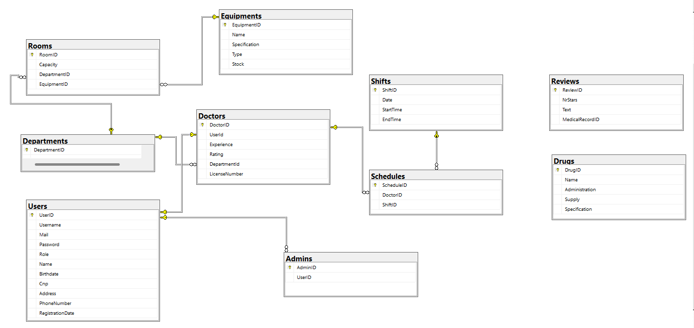

# Hospital Management Database Setup

This document provides instructions for creating and setting up the Hospital Management database.

## Prerequisites

- SQL Server installed and running
- SQL Server Management Studio (SSMS) or any other SQL client
- .NET 8 SDK installed

**!!! WARNING !!! Please ensure that all the model and view model classes have a read-only integer attribute for ID. Modify the database connections accordingly (i.e. don't insert the id into the tables)**

## Database Setup Instructions

### 1. Create the Database

1. Open SQL Server Management Studio (SSMS) or your preferred SQL client.
2. Connect to your SQL Server instance.
3. Execute the following SQL command to create the `HospitalManagement` database:

   `CREATE DATABASE HospitalManagement;`

### 2. Create the necessary procedures

Open and execute the scripts in the following files in SSMS using the right context to create the necessary stored procedures:

1. `CreateTables.sql`
2. `AddConstraints.sql`
3. `InsertData.sql`
4. `DropTables.sql`

### 3. Build the database with placeholder data

Execute the following script to build the database with dummy data:
`RebuildDB.sql`

## Diagram

